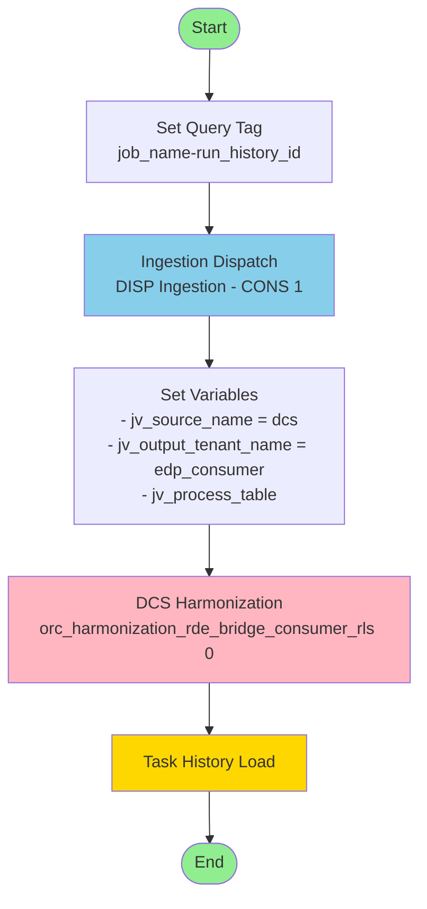
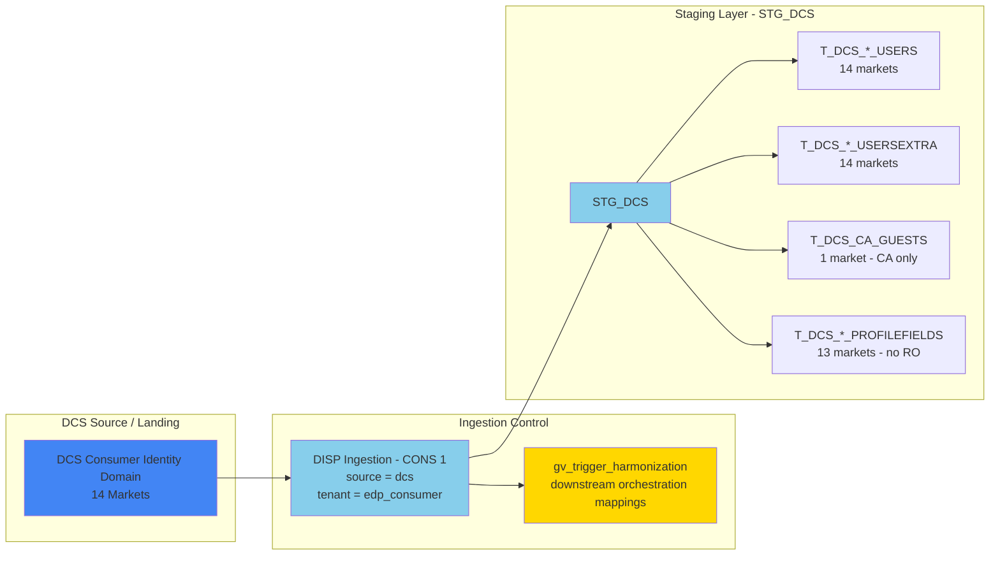
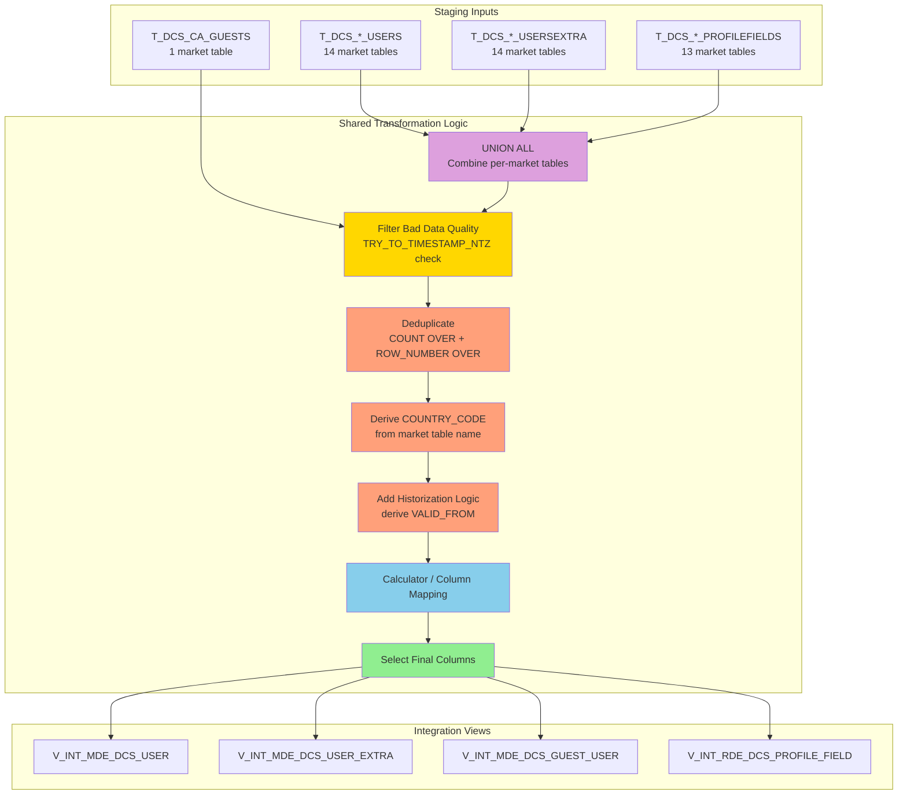
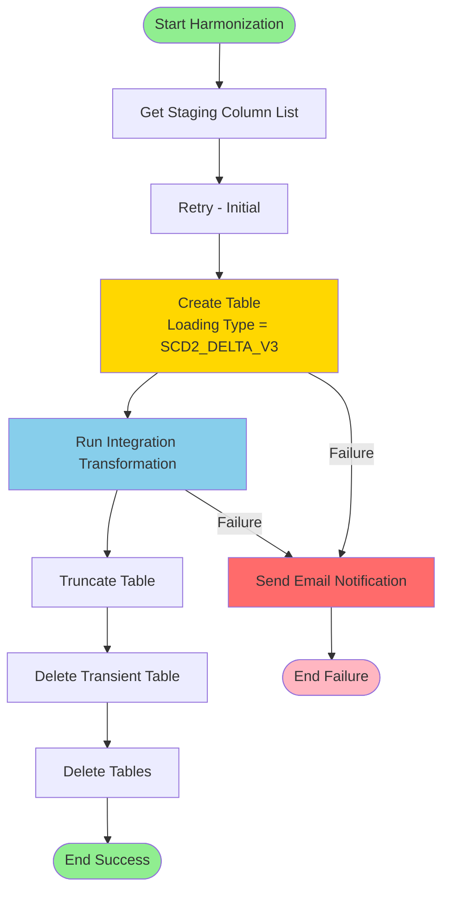
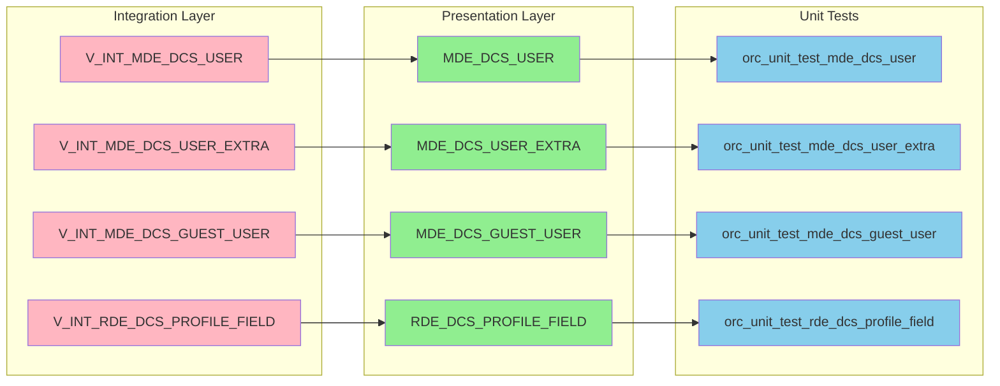
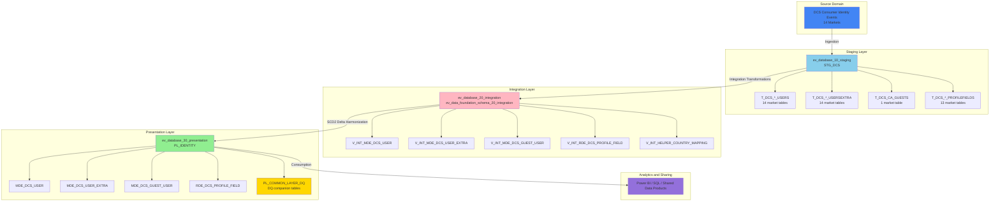
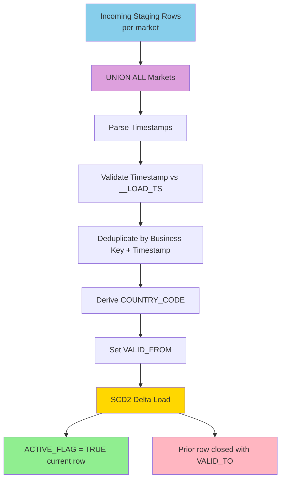
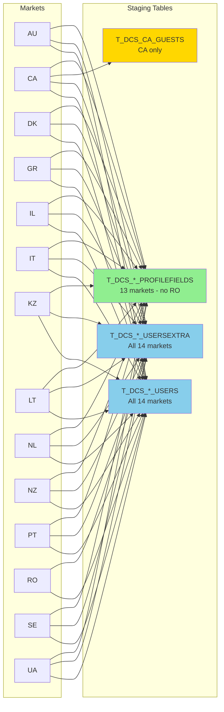

# DCS Phase 1 Pipeline Architecture Diagrams

## Master Pipeline Flow

## Multi-Market Ingestion and Staging Detail

## Integration Transformation Pattern

## Presentation Harmonization Flow

## MDE and RDE Publication Map

## Complete Data Warehouse Architecture

## SCD2 Lifecycle Pattern

## Market Coverage Matrix

