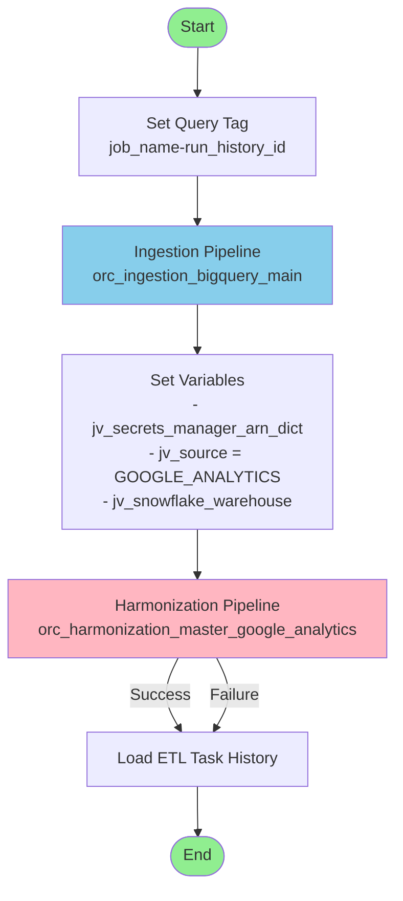
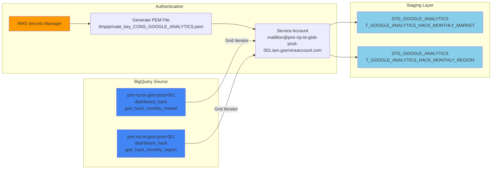
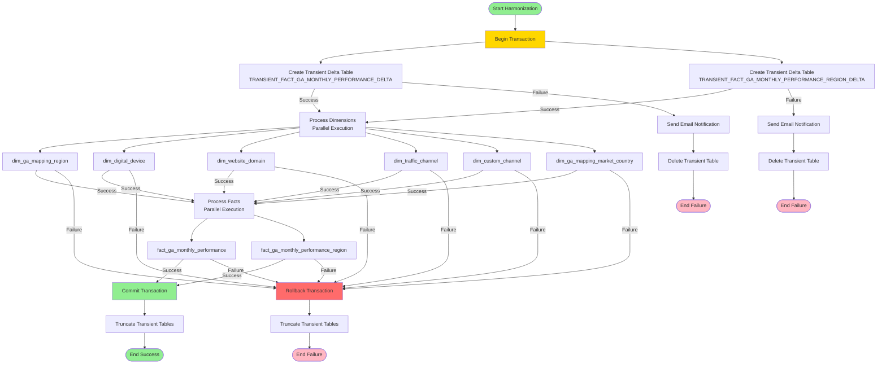
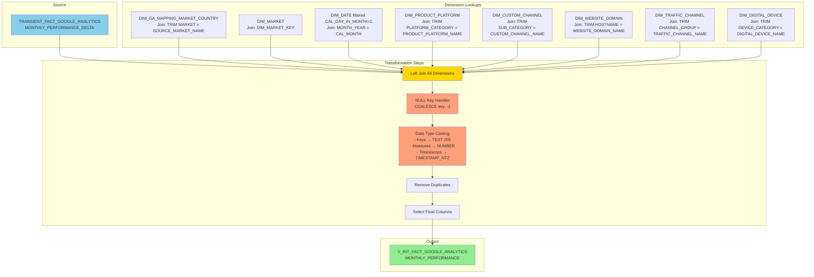
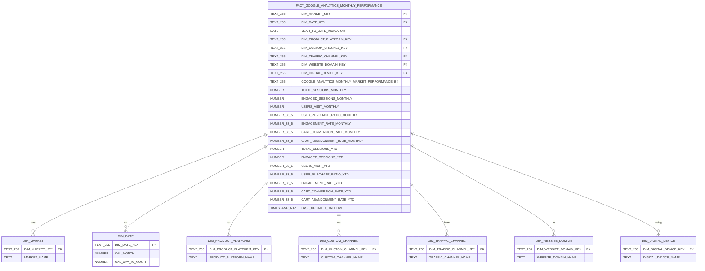
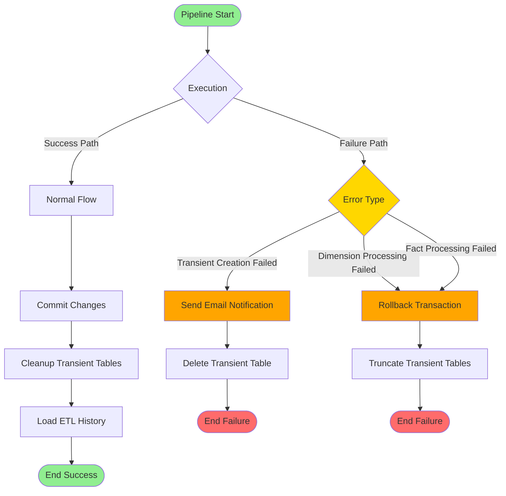

# Google Analytics Pipeline Architecture Diagrams

## Master Pipeline Flow

## Ingestion Layer Detail

## Harmonization Layer Flow

## Integration Layer Transformation Detail

## Complete Data Warehouse Architecture

```mermaid
graph TB
    subgraph "Source: Google BigQuery"
        BQ[pmi-rrp-bi-glob-prod-001<br/>dashboard_hack]
    end
    
    subgraph "Staging Layer"
        STG[STG_GOOGLE_ANALYTICS<br/>ev_database_10_staging]
        STG_T1[T_GA_HACK_MONTHLY_MARKET]
        STG_T2[T_GA_HACK_MONTHLY_REGION]
        
        STG --> STG_T1
        STG --> STG_T2
    end
    
    subgraph "Integration Layer"
        INT[ev_database_20_integration<br/>ev_data_foundation_schema_20_integration]
        
        INT_DIM[Dimensions]
        INT_D1[DIM_GA_MAPPING_MARKET_COUNTRY]
        INT_D2[DIM_GA_MAPPING_REGION]
        INT_D3[DIM_DIGITAL_DEVICE]
        INT_D4[DIM_WEBSITE_DOMAIN]
        INT_D5[DIM_TRAFFIC_CHANNEL]
        INT_D6[DIM_CUSTOM_CHANNEL]
        
        INT_VIEW[Integration Views]
        INT_V1[V_INT_FACT_GA_MONTHLY_PERFORMANCE]
        INT_V2[V_INT_FACT_GA_MONTHLY_PERFORMANCE_REGION]
        
        INT --> INT_DIM
        INT --> INT_VIEW
        INT_DIM --> INT_D1
        INT_DIM --> INT_D2
        INT_DIM --> INT_D3
        INT_DIM --> INT_D4
        INT_DIM --> INT_D5
        INT_DIM --> INT_D6
        INT_VIEW --> INT_V1
        INT_VIEW --> INT_V2
    end
    
    subgraph "Presentation Layer"
        PL[ev_database_30_presentation<br/>PL_SOCIALMEDIA]
        
        PL_FACT[Fact Tables]
        PL_F1[FACT_GA_MONTHLY_PERFORMANCE]
        PL_F2[FACT_GA_MONTHLY_PERFORMANCE_REGION]
        
        PL_DIM[Dimensions Available]
        PL_D1[DIM_MARKET from PL_COMMON_LAYER]
        PL_D2[DIM_DATE from PL_COMMON_LAYER]
        PL_D3[DIM_PRODUCT_PLATFORM from PL_COMMON_LAYER]
        PL_D4[+ GA-specific dimensions]
        
        PL --> PL_FACT
        PL --> PL_DIM
        PL_FACT --> PL_F1
        PL_FACT --> PL_F2
        PL_DIM --> PL_D1
        PL_DIM --> PL_D2
        PL_DIM --> PL_D3
        PL_DIM --> PL_D4
    end
    
    subgraph "Analytics & BI"
        BI[Tableau / PowerBI / SQL Clients]
    end
    
    BQ --> |Ingestion Pipeline| STG
    STG --> |Harmonization Pipeline| INT
    INT --> |Load to Presentation| PL
    PL --> |Queries| BI
    
    style BQ fill:#4285F4
    style STG fill:#87CEEB
    style INT fill:#FFB6C1
    style PL fill:#90EE90
    style BI fill:#9370DB
```

## Fact Table Schema

## Execution Timeline

```mermaid
gantt
    title Google Analytics Pipeline Execution Flow
    dateFormat HH:mm
    axisFormat %H:%M
    
    section Preparation
    Set Query Tag           :done, prep1, 00:00, 1m
    
    section Ingestion
    PEM File Generation     :active, ing1, 00:01, 2m
    Grid Iterator Setup     :ing2, after ing1, 1m
    Load Table 1 (Market)   :ing3, after ing2, 10m
    Load Table 2 (Region)   :ing4, after ing2, 10m
    
    section Harmonization
    Begin Transaction       :harm1, after ing3 ing4, 1m
    Create Transient Tables :harm2, after harm1, 3m
    Process Dimensions      :harm3, after harm2, 8m
    Process Facts           :harm4, after harm3, 12m
    Commit Transaction      :harm5, after harm4, 1m
    Truncate Transient      :harm6, after harm5, 2m
    
    section Finalization
    Load ETL History        :final1, after harm6, 2m
    End Pipeline            :milestone, final2, after final1, 0m
```

## Error Handling Flow

## Data Lineage

```mermaid
graph LR
    subgraph "BigQuery Source"
        BQ_M[ga4_hack_monthly_market]
        BQ_R[ga4_hack_monthly_region]
    end
    
    subgraph "Staging"
        STG_M[T_GA_HACK_MONTHLY_MARKET]
        STG_R[T_GA_HACK_MONTHLY_REGION]
    end
    
    subgraph "Integration Transient"
        TRANS_M[TRANSIENT_FACT_GA_MONTHLY_PERFORMANCE_DELTA]
        TRANS_R[TRANSIENT_FACT_GA_MONTHLY_PERFORMANCE_REGION_DELTA]
    end
    
    subgraph "Integration Views"
        VIEW_M[V_INT_FACT_GA_MONTHLY_PERFORMANCE]
        VIEW_R[V_INT_FACT_GA_MONTHLY_PERFORMANCE_REGION]
    end
    
    subgraph "Presentation"
        FACT_M[FACT_GA_MONTHLY_PERFORMANCE]
        FACT_R[FACT_GA_MONTHLY_PERFORMANCE_REGION]
    end
    
    BQ_M -->|Ingestion| STG_M
    BQ_R -->|Ingestion| STG_R
    
    STG_M -->|Create Delta| TRANS_M
    STG_R -->|Create Delta| TRANS_R
    
    TRANS_M -->|Transform & Join Dims| VIEW_M
    TRANS_R -->|Transform & Join Dims| VIEW_R
    
    VIEW_M -->|Load/Merge| FACT_M
    VIEW_R -->|Load/Merge| FACT_R
    
    style BQ_M fill:#4285F4
    style BQ_R fill:#4285F4
    style STG_M fill:#87CEEB
    style STG_R fill:#87CEEB
    style TRANS_M fill:#FFB6C1
    style TRANS_R fill:#FFB6C1
    style VIEW_M fill:#DDA0DD
    style VIEW_R fill:#DDA0DD
    style FACT_M fill:#90EE90
    style FACT_R fill:#90EE90
```

---

## Notes on Diagrams

These diagrams are rendered using Mermaid syntax and can be viewed in:
- GitHub README files
- GitLab markdown
- VS Code with Mermaid extension
- Mermaid Live Editor (https://mermaid.live)
- Confluence with Mermaid plugin
- Many documentation platforms

To view these diagrams, paste the code blocks into any Mermaid-compatible viewer or view this file in a platform that supports Mermaid rendering.
