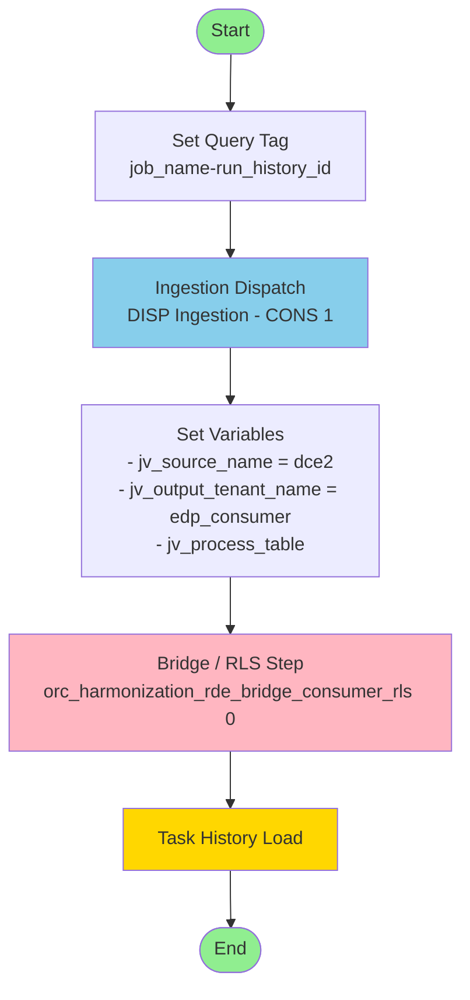
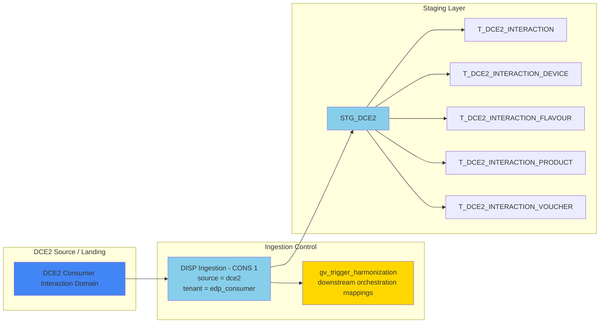
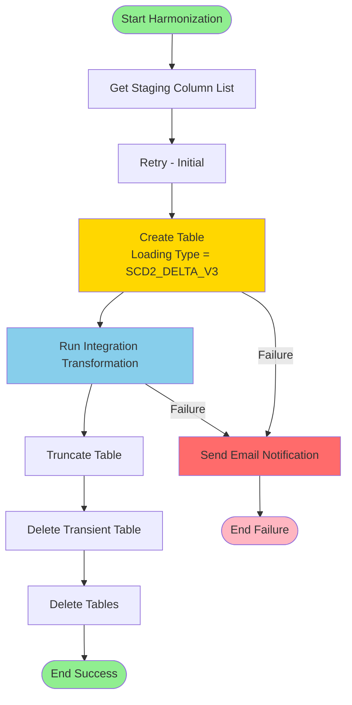
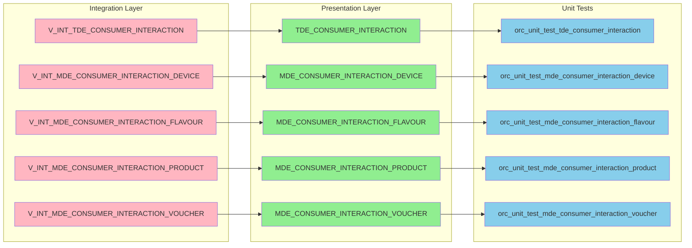
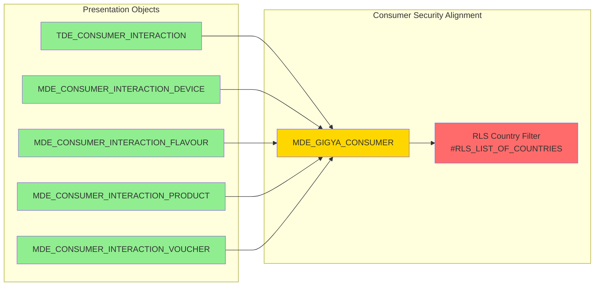
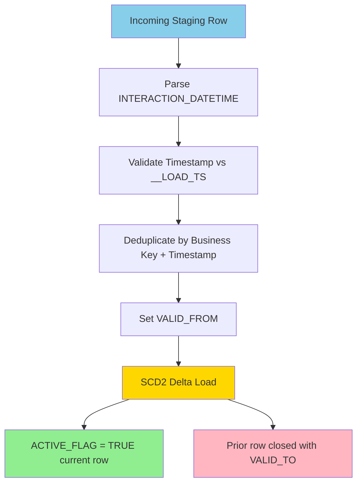

# Interactions Pipeline Architecture Diagrams

## Master Pipeline Flow



## Ingestion and Staging Detail



## Integration Transformation Pattern

```mermaid
graph TB
    subgraph "Staging Inputs"
        S1[T_DCE2_INTERACTION]
        S2[T_DCE2_INTERACTION_DEVICE]
        S3[T_DCE2_INTERACTION_FLAVOUR]
        S4[T_DCE2_INTERACTION_PRODUCT]
        S5[T_DCE2_INTERACTION_VOUCHER]
    end

    subgraph "Shared Transformation Logic"
        Filter[Filter Bad Data Quality<br/>TRY_TO_TIMESTAMP_NTZ(date_time) <= __LOAD_TS<br/>or date_time is NULL]
        Hist[Add Historization Logic<br/>derive VALID_FROM]
        Dedup[Deduplicate<br/>COUNT OVER + ROW_NUMBER OVER]
        Calc[Calculator / Column Mapping]
        Select[Select Final Columns]
    end

    subgraph "Integration Views"
        V1[V_INT_TDE_CONSUMER_INTERACTION]
        V2[V_INT_MDE_CONSUMER_INTERACTION_DEVICE]
        V3[V_INT_MDE_CONSUMER_INTERACTION_FLAVOUR]
        V4[V_INT_MDE_CONSUMER_INTERACTION_PRODUCT]
        V5[V_INT_MDE_CONSUMER_INTERACTION_VOUCHER]
    end

    S1 --> Filter
    S2 --> Filter
    S3 --> Filter
    S4 --> Filter
    S5 --> Filter

    Filter --> Hist
    Hist --> Dedup
    Dedup --> Calc
    Calc --> Select

    Select --> V1
    Select --> V2
    Select --> V3
    Select --> V4
    Select --> V5

    style Filter fill:#FFD700
    style Hist fill:#FFA07A
    style Dedup fill:#FFA07A
    style Calc fill:#87CEEB
    style Select fill:#90EE90
```

## Presentation Harmonization Flow



## MDE and TDE Publication Map



## Row-Level Security Pattern



## Complete Data Warehouse Architecture

```mermaid
graph TB
    subgraph "Source Domain"
        SRC[DCE2 Interaction Events]
    end

    subgraph "Staging Layer"
        STG[ev_database_10_staging<br/>STG_DCE2]
        STG1[T_DCE2_INTERACTION]
        STG2[T_DCE2_INTERACTION_DEVICE]
        STG3[T_DCE2_INTERACTION_FLAVOUR]
        STG4[T_DCE2_INTERACTION_PRODUCT]
        STG5[T_DCE2_INTERACTION_VOUCHER]

        STG --> STG1
        STG --> STG2
        STG --> STG3
        STG --> STG4
        STG --> STG5
    end

    subgraph "Integration Layer"
        INT[ev_database_20_integration<br/>ev_data_foundation_schema_20_integration]
        INT1[V_INT_TDE_CONSUMER_INTERACTION]
        INT2[V_INT_MDE_CONSUMER_INTERACTION_DEVICE]
        INT3[V_INT_MDE_CONSUMER_INTERACTION_FLAVOUR]
        INT4[V_INT_MDE_CONSUMER_INTERACTION_PRODUCT]
        INT5[V_INT_MDE_CONSUMER_INTERACTION_VOUCHER]

        INT --> INT1
        INT --> INT2
        INT --> INT3
        INT --> INT4
        INT --> INT5
    end

    subgraph "Presentation Layer"
        PL[ev_database_30_presentation<br/>PL_INTERACTION]
        PL1[TDE_CONSUMER_INTERACTION]
        PL2[MDE_CONSUMER_INTERACTION_DEVICE]
        PL3[MDE_CONSUMER_INTERACTION_FLAVOUR]
        PL4[MDE_CONSUMER_INTERACTION_PRODUCT]
        PL5[MDE_CONSUMER_INTERACTION_VOUCHER]

        DQ[PL_COMMON_LAYER_DQ<br/>DQ companion tables]

        PL --> PL1
        PL --> PL2
        PL --> PL3
        PL --> PL4
        PL --> PL5
    end

    subgraph "Analytics & Sharing"
        BI[Power BI / SQL / Shared Data Products]
    end

    SRC --> |Ingestion| STG
    STG --> |Integration Transformations| INT
    INT --> |SCD2 Delta Harmonization| PL
    PL --> |Consumption| BI
    PL --> DQ

    style SRC fill:#4285F4
    style STG fill:#87CEEB
    style INT fill:#FFB6C1
    style PL fill:#90EE90
    style DQ fill:#FFD700
    style BI fill:#9370DB
```



## SCD2 Lifecycle Pattern


