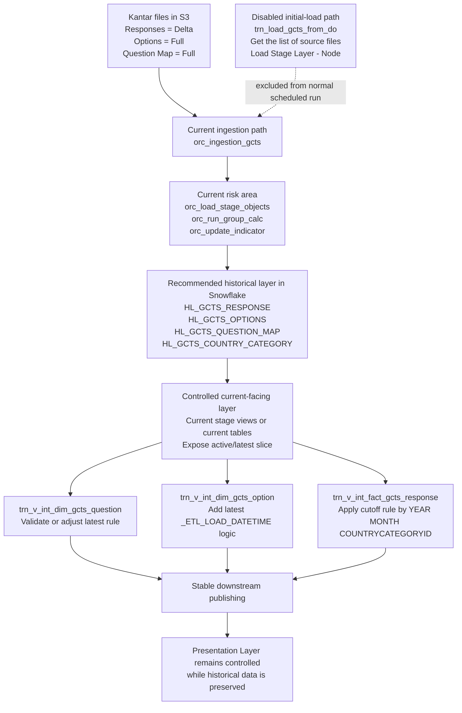

# GCTS Strategy Implementation Diagram

## Notes

- Recommended strategy: hybrid approach
- Preserve history in dedicated Snowflake history tables
- Keep a controlled current-facing layer for downstream consumption
- Adjust the 3 target transformations intentionally
- Exclude the disabled initial-load path from the normal scheduled-run design
